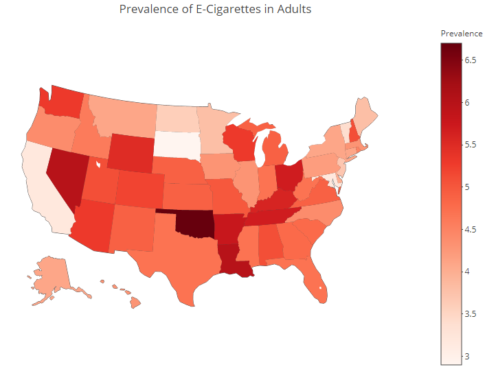
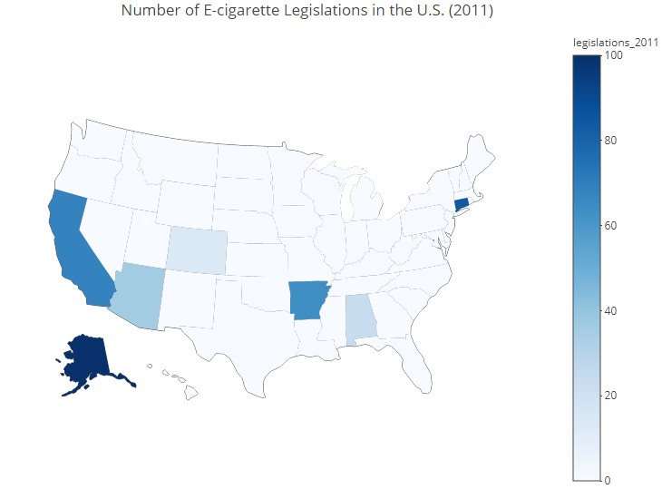
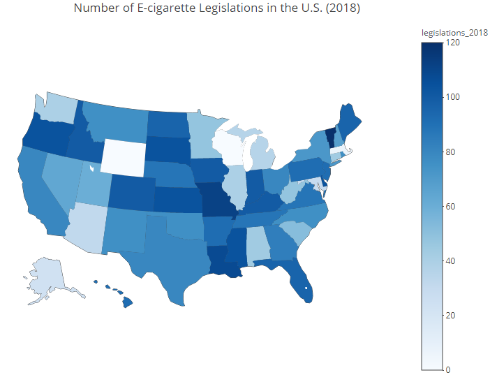

```{r setup, include=FALSE, message=FALSE}
#loading packages
library(tidyverse)
library(srvyr)
library(viridis)
library(rvest)
library(httr)
<<<<<<< HEAD
=======
library(plotly)
library(maps)
library(webshot)
>>>>>>> 668e8c6b6afd23fc3817f986ad3e6ee326b40bad

#setting up document
knitr::opts_chunk$set(
	warning = FALSE,
	message = FALSE,
	fig.width = 8, 
  fig.height = 6,
  out.width = "90%"
)

#ggplot document wide settings
options(
  ggplot2.continuous.colour = "viridis",
  ggplot2.continuous.fill = "viridis"
)
scale_colour_discrete = scale_colour_viridis_d
scale_fill_discrete = scale_fill_viridis_d

theme_set(theme_minimal() + theme(legend.position = "bottom"))

#loading data 
ecig_data = read.csv("./clean_data/ecig_data.csv")  
legislation_data = read_csv("./clean_data/legislation_data.csv") 
state_prev = read_csv("./clean_data/state_prev.csv")
```

## Motivation
Electronic cigarette (e-cigarette) use has become a growing public health concern. As of October 29, 2019, there have been 1,888 cases of lung injury due to e-cigarette use, or vaping, reported to the CDC from 49 states [(1)](https://www.cdc.gov/tobacco/basic_information/e-cigarettes/severe-lung-disease.html). Medical officials have become increasingly interested in the development of lung disease among users; however, there is still little known about the deleterious effects of e-cigarette use. While e-cigarettes and vapes were initially intended for current smokers to reduce tobacco dependency, these products have been massively marketed to teenagers with no smoking history. The goal of this project is to elucidate trends in e-cigarette use among youth in order to inform the development and implementation of preventive and therapeutic interventions.

## Related Work
The linkage between e-cigarette use and lung injury has gradually become more evident through scientific research [(2)](https://www.ncbi.nlm.nih.gov/pmc/articles/PMC6776378/) [(3)](https://onlinelibrary.wiley.com/doi/full/10.1002/rcr2.282). Therefore, many have started to criticize suppliers, particularly because of their marketing towards teenagers. Companies such as JUUL have been accused of targeting younger individuals through introducing fruity flavors and running social media campaigns. Many have studied this phenomenon through the surveys to better understand patterns of use among young users and their interest in e-cigarettes. A recent study assessed responses from a nationally representative survey of participants ages 15-21 in 2018 and found that younger age, race, higher socioeconomic status, and perception that e-cigarettes are less harmful than standard cigarettes were all correlated with a higher risk of using e-cigarettes [(4)](https://tobaccocontrol.bmj.com/content/28/6/603.abstract?casa_token=1PALiqs1TR0AAAAA:bwza2kpvUrDvqaHwd1Eb9lVT3WoYpW3Um5QgUNo_m1bOCA7Vk3KW_-4X7jWT8M-izEn2AxPJ8ekh). A similar study conducted an online survey and found that in 2017, one fourth of youth and young adults recognized a JUUL device, and identified a lack of awareness regarding the potential harms of using electronic cigarettes [(5)](https://tobaccocontrol.bmj.com/content/28/1/115.abstract?casa_token=jha9u61gODYAAAAA:zNkcmBbrIMpDW7jAoCGVb3L97MvluMMSOPN8tddPrPoZK91Nnrb-YdZ-tCqWm_88YbtKIB1rUifT). However, these studies were not able to analyze e-cigarette use across time.

## Initial Questions

1. How has e-cigarette use among youth changed from 2011-2018?    

We wish to visualize patterns in e-cigarette use over time. While we know from outside sources that e-cigarettes have become very popular over the past few years, we hope to demonstrate this trend through visualizations to gain insights into when and to what degree e-cigarette use has changed from 2011-2018.

2. What factors put an individual at greatest risk of e-cigarette use?  

We will consider several demographics such as age, sex and race, as well as cigarette consumption, perception towards the harm of e-cigarettes, and the frequency of e-cigarette ads viewed.

3. How has legislation changed over time to address the growing rate of e-cigarette use throughout the United States?  

To build on previous studies, we want to consider the geographic component of e-cigarette use and attempts to reduce youth access to e-cigarettes.

## Data
Our analysis was conducted using three data sources. The fist dataset is the National Youth Tobacco Survey administered by CDC [(6)](https://www.cdc.gov/tobacco/data_statistics/surveys/nyts/data/index.html). We used survey data from 2011-2018. The surveys were completed by 8-19 year olds from across the United States to address trends in tobacco and e-cigarette use. To tidy the data, we extracted questions from the survey that pertained to e-cigarette use that were consistent throughout our study period. Since e-cigarette questions were not introduced until 2011, we restricted our analysis to 2011-2018. Some questions of interest were not included in all years. To account for this, we assigned missing values (`NA`) to observations in the years for which the question was not asked. The resulting dataset, `ecig_data`, contains `r nrow(ecig_data)` observations and `r ncol(ecig_data)` variables:

* `cig_days`: *"How many cigarettes have you smoked in the past 30 days?"*   
              levels: 0, 1-2, 3-5, 6-9, 10-19, 20-29, 30
* `try_ecigs`: *"Have you ever tried electronic cigarettes?"*   
              levels: yes, no
* `current_ecigs`: *"Have you used electronic cigarettes in the last 30 days?"*   
              levels: yes, no
* `quit_cig`: *"Are you trying to quit cigarettes?"*   
              levels: not a smoker, within the next 30 days, within the next 6 months, within 1 year, in over a year, no
* `heard_ecigs`: *"Have you heard of electronic cigarettes?"* (years 2012-2013)  
              levels: yes, no
* `harm_ecigs`: *"In your opinon, how harmful are electronic cigarettes compared to regular cigarettes?"* (years 2012-2018)  
              levels: less harmful, equally harmful, more harmful, never heard of e-cigarettes, unknown
* `age_first_ecig`: *"What age were you when you used an electronic cigarette for the first time?"* (years 2014-2018)     
              levels: never, 8 or younger, 9-18
* `reasons_ecigs`: *"Are you using electronic cigarettes to quit smoking?"* (years 2015-2018)   
              levels: yes, no
* `ads_ecigs` : *"When using the internet, how often do you see advertisements for electronic cigarettes?"*  
              levels: always, most of the time, sometimes, rarely, never, do not use the Internet  
* `weight` : a weight value assigned to each survey respondent to account for different representations among demographic groups  
* `year` : 2011-2018
* `sex` :  
              levels: male, female
* `race` :  
              levels: white, black, hispanic, asian, american indian / alaska native, native hawaiian / other pacific islander

Missingness varies over years and variables. In our analyses, we use only complete cases.
```{r results='asis'}
#NA Table
ecig_data %>%
  group_by(year) %>%
  summarise(cig_days = ifelse(mean(is.na(cig_days)) == 1, NA, mean(is.na(cig_days))),
            try_ecigs = mean(is.na(try_ecigs)),
            current_ecigs = mean(is.na(current_ecigs)),
            quit_cig = mean(is.na(quit_cig)),
            heard_ecigs = ifelse(mean(is.na(heard_ecigs)) == 1, NA, mean(is.na(heard_ecigs))),
            harm_ecigs = ifelse(mean(is.na(harm_ecigs)) == 1, NA, mean(is.na(harm_ecigs))),
            age_first_ecig = ifelse(mean(is.na(age_first_ecig)) == 1, NA, mean(is.na(age_first_ecig))),
            reasons_ecigs = ifelse(mean(is.na(reasons_ecigs)) == 1, NA, mean(is.na(reasons_ecigs))),
            ads_ecigs = ifelse(mean(is.na(ads_ecigs)) == 1, NA, mean(is.na(ads_ecigs))),
            sex = mean(is.na(sex)),
            race = mean(is.na(race))
            ) %>%
  knitr::kable(digits = 2, caption = "Percent of missingness in each variable per year")
```

Additionally, we question the representation of the sample for 9 and 10 year olds, since over half of the 9 year olds and over a quarter of the 10 year olds who completed the survey reported that they are cigarette smokers. This is clearly not representative of the population, so these ages were excluded in some analyses.
```{r results='asis'}
#HALF OF 10 YEAR OLDS ARE SMOKER 
ecig_data %>%
  filter(is.na(age) == F) %>%
  mutate(current_cig = as.numeric(cig_days != "0"),
         current_ecigs = as.numeric(current_ecigs == "yes") )%>%
  group_by(age) %>%
  summarise("Proportion Cig Smokers" = weighted.mean(current_cig, as.numeric(weight), na.rm = TRUE),
            "Proportion E-cig Smokers" = weighted.mean(current_ecigs, as.numeric(weight), na.rm = TRUE)) %>%
  knitr::kable(digits = 2)
```

The second data source is the CDC's State Tobacco Activities Tracking and Evaluation System [(7)](https://catalog.data.gov/dataset/cdc-state-system-e-cigarette-legislation-youth-access-a2edb). This data contains information on electronic cigarette legislation across the United States from 2011 to 2018. The resulting data set, `legislation_data` has `r nrow(legislation_data)` observations and `r ncol(legislation_data)` variables including:

* `year` : 2011-2018
* `location_abbr` : state abbreviation
* `location_desc` : state name
* `effective_date` : date on which the legislation became effective
* `geo_location` : geographic coordinates where legislation was enacted

Lastly, we will briefly refer to the CDC's State-Specific Patterns of E-Cigarette Use from 2016 [(8)](https://www.cdc.gov/pcd/issues/2019/18_0362.htm). This data provides the current prevalence of adult e-cigarette users within each state. The data has `r nrow(state_prev)` rows, denoting each state and the District of Columbia, and `r ncol(state_prev)` variables, denoting state names and their respective total, male, and female prevalences of e-cigarette use in 2016. 

## Exploratory Analysis
To address our first question, we created line plots to visualize how frequency of e-cigarette and standard cigarette use among youth have changed from 2011-2018. 

```{r}
ecig_data %>% 
  select(year, weight, ecigs_past_month, cig_days) %>% 
  mutate(
    ecigs_past_month = recode(ecigs_past_month, 
                                     "*" = "NA",
                                     "0" = "0",
                                     "1-2" = "1.5",
                                     "3-5" = "4", 
                                     "6-9" = "7.5", 
                                     "10-19" = "14.5", 
                                     "20-29" = "24.5", 
                                     "30" = "30"),
    cig_days = recode(cig_days, 
                                     "*" = "NA",
                                     "0" = "0",
                                     "1-2" = "1.5",
                                     "3-5" = "4", 
                                     "6-9" = "7.5", 
                                     "10-19" = "14.5", 
                                     "20-29" = "24.5", 
                                     "30" = "30")
  ) %>% 
  group_by(year) %>% 
  summarize(
    cig_days = weighted.mean(as.numeric(cig_days), as.numeric(weight), na.rm = TRUE), 
    ecig_days = weighted.mean(as.numeric(ecigs_past_month), as.numeric(weight), na.rm = TRUE)
  ) %>%
  pivot_longer(cig_days:ecig_days, values_to = "mean_days", names_to = "type") %>% 
  filter(mean_days!="NaN") %>% 
  ggplot(aes(x = year, y = mean_days)) + 
  geom_line(aes(group = type, color = type)) + 
  geom_point(aes(color = type)) + 
  scale_color_manual(
    values = c("#440154FF", "#20A387FF"),
    name = "",
    breaks=c("cig_days", "ecig_days"),
    labels=c("Cigarettes", "E-Cigs")
    ) +
  labs(title = "Average days of smoking per month", y = "Days Smoking", x = "Year") 
  
```

Overall, we can see that average monthly cigarette use has decreased from 2011-2018. Data on average monthly e-cigarette use is only available from 2015-2018; however, we can observe that e-cigarette use was more frequent than standard cigarette use from 2015-2018. E-cigarette use spiked from 2017-2018, but there does not seem to be evidence of a relationship between e-cigarette and standard cigarette use from this figure.

In addition to exploring e-cigarette use among youth over time, we created a map to consider prevalence of e-cigarette use among adults in 2016, since this data is not publicly available for youth. Although this is adult data and different trends are likely to be observed between e-cigarette use among adults and youth, this data helps us to visualize e-cigarette use nationwide and to identify states with potentially high rates of e-cigarette sales.

<<<<<<< HEAD
INSERT PREVALENCE MAP HERE!!!
=======
```{r, echo=FALSE, out.width="80%"}

```
>>>>>>> 668e8c6b6afd23fc3817f986ad3e6ee326b40bad

From this map, we can see that South Dakota had the lowest prevalence of e-cigarette use (2.9%) and Oklahoma had the highest prevalence of e-cigarette use (6.7%) in 2016. Overall, Appalachia and the Southwest appeared to have the highest prevalences of e-cigarette use, while states in the Northeast had some of the lowest prevalences, in 2016. A complete interactive graph is available on our [website](https://rsilva19.github.io/ecig_trends.github.io).

To address our second question, we created bar plots and summary tables to assess how standard cigarette use, perception of the harmfulness of e-cigarette use, socioeconomic measures, and corporate marketing may have affected e-cigarette use from 2011-2018. First, we explored if cigarette smokers were more likely to try e-cigarettes compared to non-smokers.

```{r}
#smokers are more likley to try ecigs
ecig_data %>%
  filter(is.na(age) == FALSE, is.na(try_ecigs) == FALSE, is.na(cig_days) == FALSE,
         !age %in% c("9", "10")) %>%
  mutate(current_cig = as.numeric(cig_days != "0")) %>%
  mutate(current_cig = factor(current_cig, levels = c(0,1), labels = c("non-smoker", "smoker"))) %>%
  group_by(age, current_cig) %>%
  mutate(indc = ifelse(try_ecigs == "yes", 1, 0)) %>%
  summarise(y = weighted.mean(indc, as.numeric(weight))) %>%
  ggplot(aes(x = as.numeric(age), y = y, color = current_cig)) +
  geom_point() +
  geom_line() +
  xlab("Age") +
  ylab("Proportion Tried E-cigarettes") +
  labs(color = "Smoking Status",
       title = "Proportion who have tried e-cigarettes, by age") +
  scale_color_manual(values = c("#440154FF", "#20A387FF")) +
  scale_x_continuous(breaks = seq(9, 19, 2))
```

Individuals 10 years old and below were removed due to the lack of representation described in the Data section. However, we can see that from ages 11-19+ years old, the proportion of non-smokers who have tried e-cigarettes is considerably lower than the proportion of smokers across all years. This suggests that smokers were more likely to use e-cigarettes than non-smokers. There is an overall increase in the proportion of both smokers and non-smokers who have tried e-cigarettes with increasing age.

Next, we created a bar plot to visualize average monthly e-cigarette use from 2011-2018 by race/ethnicity.
```{r}
ecig_data %>% 
  mutate(
    ecigs_past_month = recode(ecigs_past_month, 
                                     "0" = "0",
                                     "1-2" = "1.5",
                                     "3-5" = "4", 
                                     "6-9" = "7.5", 
                                     "10-19" = "14.5", 
                                     "20-29" = "24.5", 
                                     "30" = "30"),
    ecigs_past_month = as.numeric(ecigs_past_month), 
  ) %>% 
  select(ecigs_past_month, race, weight) %>% 
  mutate(race = fct_relevel(race, c("native hawaiian / other pacific islander", "american indian / alaska native", "white", "hispanic", "black", "asian"))) %>% 
  drop_na() %>% 
  group_by(race) %>% 
  summarize(ecig_use = round(weighted.mean(ecigs_past_month, as.numeric(weight)), digits = 3))  %>% 
  arrange(ecig_use) %>% 
  ggplot(aes(x = race, y = ecig_use, fill = race)) + 
  geom_bar(stat = "identity") + 
  coord_flip() + 
  scale_x_discrete(name= "", labels = c("Hawaiian/Pacific", "American Indian", "White", "Hispanic", "Black", "Asian")) + 
  labs(y = "Monthly E-cigarette Use", title = "Average monthly e-cigarette use, by race") + 
  theme(legend.position = "none")
```

This plot shows that Hawaiian and other pacific islander youth have the highest average rate of e-cigarette use per month, whereas Asian youth have the lowest average rate, from 2011-2018.

We also stratified the annual proportions of e-cigarette use by sex and age.

```{r}
ecig_data %>%
  filter(is.na(try_ecigs) == FALSE, is.na(sex) == FALSE) %>%
  group_by(year, sex) %>%
  mutate(indc = ifelse(try_ecigs == "yes", 1, 0)) %>%
  summarise(y = weighted.mean(indc, as.numeric(weight))) %>%
  ggplot(aes(x = year, y = y, fill = sex)) +
  geom_col(position = "dodge") +
  ylab("Proportion Tried E-cigarettes") +
  labs(fill = "Sex",
       title = "Proportion who have tried e-cigarettes, by year and sex") +
  xlab("Year") 
```

From 2011-2018, we can see that the proportion of males who have tried e-cigarettes is consistently higher than females. Furthermore, both the male and female proportions spike from 2013-2014 and then relatively plateau from 2014-2018.

```{r}
ecig_data %>%
  filter(is.na(age) == FALSE, is.na(sex) == FALSE, is.na(try_ecigs) == FALSE,
         !age %in% c("9", "10")) %>%
  group_by(age, sex) %>%
  mutate(indc = ifelse(try_ecigs == "yes", 1, 0)) %>%
  summarise(y = weighted.mean(indc, as.numeric(weight))) %>%
  ggplot(aes(x = age, y = y, fill = sex)) +
  geom_col(position = "dodge") +
  xlab("Age") +
  ylab("Proportion Tried E-cigarettes") +
  labs(fill = "Sex",
       title = "Proportion who have tried e-cigarettes, by age and sex") +
  scale_x_continuous(breaks = seq(11, 19, 2))
```

Again, all individuals 10 years old or younger were excluded due to the lack of representation described in the Data section. This bar plot displays a similar trend to the line plots above. Overall, we can observe that the proportion of individuals who have tried e-cigarettes has increased with age from 2011-2018. However, this plot shows that these proportions also increase among males and females.

Next, we examined how individuals' perceptions of the harmfulness of e-cigarettes compared to standard cigarettes may have changed over time. This information would help us to determine if perception of harm is associated with increased e-cigarette use from 2012-2018.

```{r}
#creating survey object 
srv_ecig = ecig_data %>% 
  mutate(id = row_number()) %>% 
   as_survey_design(id = id, wt = as.numeric(weight) )

#plot of harmful vs year 
srv_ecig %>% 
  filter( !is.na(quit_cig) , quit_cig != "not a smoker" ) %>% 
  filter( !is.na(harm_ecigs) ) %>%
  mutate(harm_ecigs = recode(harm_ecigs, "equally addictive" = "equally", "less addictive" = "less", "more addictive" = "more"), 
         ecigs_past_month = factor(ecigs_past_month, c(NA, "0", "1-2", "3-5", "6-9", "10-19", "20-29", "30"))
         ) %>% 
  filter( harm_ecigs =="less"| harm_ecigs =="equally" | harm_ecigs =="more") %>%
  filter( year != "2013", year != "2015") %>% 
  mutate(harm_ecigs = fct_relevel(harm_ecigs, c("less", "equally", "more"))) %>% 
  group_by(year, harm_ecigs) %>% 
  summarize(n = survey_total()) %>% 
  mutate(prop = n/sum(n)) %>% 
  ggplot(aes( x = factor(year), y = prop, fill = harm_ecigs)) + 
  geom_bar(position ="dodge", stat ="identity") +
  labs(
    title = "Perception of Harmfulness of E-Cigarettes Compared to Cigarettes",
    x = "Year",
    y = "Proportion of Belief",
    fill = "Harmfulness compared to cigarettes") +
  theme(plot.title = element_text(hjust = 0.5))
```

No harmfulness data was available for 2011, 2013, or 2015, so these years have been excluded. For the remaining years, most individuals believed that e-cigarettes were less harmful than standard cigarettes, which may be linked to the recent increase in e-cigarette use in the United States. However, since 2012, there has been an overall decrease in the perception that e-cigarettes are less harmful than standard cigarettes. This trend is understandable, since researchers have been finding increasing evidence that e-cigarette use is associated with lung injury.

We also considered how the rate of viewing e-cigarette ads on the Internet may affect average monthly e-cigarette use.

```{r results='asis'}
ecig_data %>% 
  mutate(
    ecigs_past_month = recode(ecigs_past_month, 
                                     "*" = "NA",
                                     "0" = "0",
                                     "1-2" = "1.5",
                                     "3-5" = "4", 
                                     "6-9" = "7.5", 
                                     "10-19" = "14.5", 
                                     "20-29" = "24.5", 
                                     "30" = "30"),
    ecigs_past_month = as.numeric(ecigs_past_month), 
    ads_ecigs = replace(ads_ecigs, ads_ecigs == "do no use the internet", "do not use the internet"), 
    ads_ecigs = fct_relevel(ads_ecigs, c("never", "rarely", "sometimes", "most of the time", "always", "do not use the internet"))
  ) %>% 
  
  select(ecigs_past_month, ads_ecigs, weight) %>% 
  drop_na() %>% 
  filter(ads_ecigs != "do not use the internet") %>% 
  group_by(ads_ecigs) %>% 
  summarize('Avg Days of E-Cig Use' = round(weighted.mean(ecigs_past_month, as.numeric(weight)), digits = 3)) %>% 
  rename("Viewing Rate of Internet E-Cig Ads" = ads_ecigs) %>%
  knitr::kable(digits = 2)
```

This table shows that as the viewing rate of Internet e-cigarette ads increases, average monthly e-cigarette use increases from 1.17 days (among individuals who never viewed ads) to 1.71 days (among individuals who always viewed ads).  

To address our third question, we created a U.S. maps to display the number of legislations regarding e-cigarette use in each state.

<<<<<<< HEAD
INSERT LEGISLATION MAPS HERE!!!
=======
To address our third question, we created U.S. maps to display the number of legislations regarding e-cigarette use enacted in each state. The maps below represent state-specific amounts of e-cigarette legislation in 2011 and 2018.

```{r, echo=FALSE, out.width="80%"}


```

These maps show that the number of legislations regarding e-cigarette use have largely increased from 2011-2018, as they have become increasingly viewed as dangerous. In 2011, only a few states (Alaska, California, and Connecticut) had passed legislation to restrict access and use of e-cigarettes among youth, since the trend was just starting. This likely reflects the company Juul gaining a lot of popularity through media campaigns, particularly in California. However, by 2018, all but two states in the U.S. (Wisconsin and Wyoming) had laws controlling e-cigarette use among adolescents, as use among minors now sweeps the country. This trend reflects the growing popularity of e-cigarette use among teenagers across the United States, as we observed from the survey data. As more youth began using e-cigarettes, legislators reacted with policy development to restrict youth consumption and access to e-cigarettes.

You can refer to the "Legislation" page on our website to look at the specific legislations that were enacted in each state every year. Complete interactive graphs are available on our [website](https://rsilva19.github.io/ecig_trends.github.io).
>>>>>>> 668e8c6b6afd23fc3817f986ad3e6ee326b40bad

## Additional Analysis

Finally, we built a logistic regression model to make inferences regarding factors associated with e-cigarette use among youth. We used seven covariates in our model:

* `age` : constrained to 11-18 years old, due to the non-representation of this sample
* `year` : constrained to 2015-2018, due to limited data available for the outcome of interest
* `sex` : reference = male
* `race` : reference = white
* `cig_days` : reference = 0 days
* `harm_ecigs` : reference = never heard of e-cigs
* `ads_ecigs` : reference = never

Our outcome of interest was `current_ecigs` (1 = current e-cigarette user, 0 = does not currently use e-cigarettes).

```{r results='asis', message=FALSE}
ecig_data_for_regression = 
  read.csv("./clean_data/ecig_data.csv") %>%
  mutate(age = as.numeric(age),
         year = as.numeric(year),
         weight = as.numeric(weight),
         sex = factor(sex),
         race = factor(race),
         cig_days = factor(cig_days),
         try_ecigs = factor(try_ecigs),
         quit_cig = factor(quit_cig),
         harm_ecigs = factor(harm_ecigs),
         ads_ecigs = factor(ads_ecigs),
         current_ecigs = factor(current_ecigs)) %>%
  filter(!age %in% c("9", "10", "19"),
         year >= 2014,
         is.na(current_ecigs) != TRUE) %>%
  mutate(id = row_number())


full_log_model = glm(current_ecigs ~ age + year + sex + 
                       relevel(race, ref = "white") +
                       cig_days + 
                       relevel(harm_ecigs, ref = "never heard of e-cigs") + 
                       relevel(ads_ecigs, ref = "never"),
                     family = binomial,
                     data = ecig_data_for_regression)

#Table of beta estimates, SE, ORs, CIs, and p-values
log_model_summary = 
  tibble(
  "Variable" = c("intercept", "age", "year", "sex (male)", "race (Indian/Native)", "race (Asian)", "race (Black)", 
               "race (Hispanic)", "race (Haiwaiian/Pacific)", "cig_days (1-2)", "cig_days (10-19)",
               "cig_days (20-29)", "cig_days (3-5)", "cig_days (30)", "cig_days (6-9)", 
               "harm_ecigs (equally harmful)", "harm_ecigs (less harmful)", "harm_ecigs (more harmful)",
               "harm_ecigs (unknown)", "ads_ecigs (always)", "ads_ecigs (do not use Internet)",
               "ads_ecigs (most of the time)", "ads_ecigs (rarely)", "ads_ecigs (sometimes)"),
  "Estimate" = round(summary(full_log_model)$coefficients[, 1], digits = 2),
  "SE" = round(summary(full_log_model)$coefficients[, 2], digits = 2),
  "OR" = round(exp(coef(full_log_model)), digits = 2),
  "OR CI (2.5%)" = round(exp(confint(full_log_model))[, 1], digits = 2),
  "OR CI (97.5%)" = round(exp(confint(full_log_model))[, 2], digits = 2),
  "P-value" = round(summary(full_log_model)$coefficients[, 4], digits = 3))
  
log_model_summary %>% knitr::kable()
```

The table above displays the output from the logistic model, including beta estimates with standard errors, odds ratios with 95% confidence intervals, and p-values. We can see that both continuous variables (year and age) are significantly associated with e-cigarette use at the 0.05 significance level, since `p < 0.05` and their respective 95% odds ratio confidence intervals exclude 1. Since the odds ratios for year and age are greater than 1, as these variables increase, the odds of using e-cigarettes also increases. For each of the remaining categorical variables, at least one level was found to be associated with e-cigarette use.  

From the table, we can conclude that males have significantly higher odds of e-cigarette use compared to females. Furthermore, Asian, Black, and Hispanic individuals have lower odds of e-cigarette use compared to White individuals. No significant difference is obtained for American Indians and Hawaiians or other Pacific Islanders. Additionally, we found that individuals who use cigarettes one or more days per month, on average, have higher odds of using e-cigarettes compared to those who do not use cigarettes. Interestingly, as the average number of days of cigarette use increases, the odds of e-cigarette use does not always increase. For instance, individuals who reported smoking cigarettes for 10-19 days per month, on average, had the highest odds of using e-cigarettes (higher than the odds among more frequent cigarette users). 

In regards to individuals' perception of the harmfulness of e-cigarettes, we found that for every level of perceived harm, the odds of e-cigarette use were higher compared to those who had never heard of e-cigarettes. People had lower odds of using e-cigarettes if they believed that e-cigarettes were more harmful than standard cigarettes. Similarly, individuals who believed that e-cigarettes were less harmful than standard cigarettes had higher odds of e-cigarette use. In addition, individuals who did not know whether e-cigarettes were more or less harmful than standard cigarettes had lower odds of e-cigarette use, compared to those who had never heard of e-cigarettes.

Finally, compared to people who never viewed Internet e-cigarette ads, individuals who viewed ads at any rate had significantly higher odds of using e-cigarettes. As the rate of viewing e-cigarette ads increases, the odds of e-cigarette use also increase, which is expected. Interestingly, those who did not use the Internet had higher odds of using e-cigarettes compared to those never viewed ads on the Internet.

```{r}
##OR plot
ggplot(log_model_summary, aes(x = Variable, y = OR)) +
  geom_pointrange(ymin = log_model_summary$`OR CI (2.5%)`, ymax = log_model_summary$`OR CI (97.5%)`) +
  geom_hline(aes(yintercept = 1), linetype = "dashed") +
  ylim(c(0, 17)) +
  coord_flip() +
  labs(title = "95% OR CIs")
```

The plot above shows which variables are associated with e-cigarette use. All intervals that exclude 1 (denoted by a dashed line) represent significant variables.

## Discussion
From this research, we were able to demonstrate how e-cigarette consumption among youth has grown over time from 2011 to 2018. We also found that e-cigarette consumption is significantly higher among cigarette smokers, older youth, males, White individuals, and people who perceived e-cigarettes to be less harmful than cigarettes. Our findings match the results of previous studies geared towards investigating patterns of e-cigarette use among youth. However, it is surprising that all seven variables included in the logistic regression model are significant (`p < 0.05`). This includes the rate of viewing e-cigarette ads on the Internet, a novel addition to the literature. Individuals who viewed more ads online were more likely to use e-cigarettes. Additionally, we were able to determine that legislation restricting youth access to e-cigarettes has increased steadily from 2011 to 2018 across the United States, as expected. This is likely a reaction to the rising rates of e-cigarette use across the nation.

A strength of our study includes analyzing survey data from a nationally representative sample to assess trends in e-cigarette use among youth. However, our study did have some limitations. First, we had limited data available pertaining to prevalence of e-cigarette use among youth. Therefore, to gain an idea, we visualized prevalence of e-cigarette use among adults in 2016. In addition, we were unable to incorporate the weights introduced by the survey data into the logistic regression model, since the large weight values (>1000) prevented model construction. Lastly, since this is an exploratory analysis, we are unable to establish causality between any exposure or outcome variables.

Identifying risk factors of e-cigarette use is necessary to better understand the epidemic and to implement new public health policies to reduce e-cigarette consumption among youth.